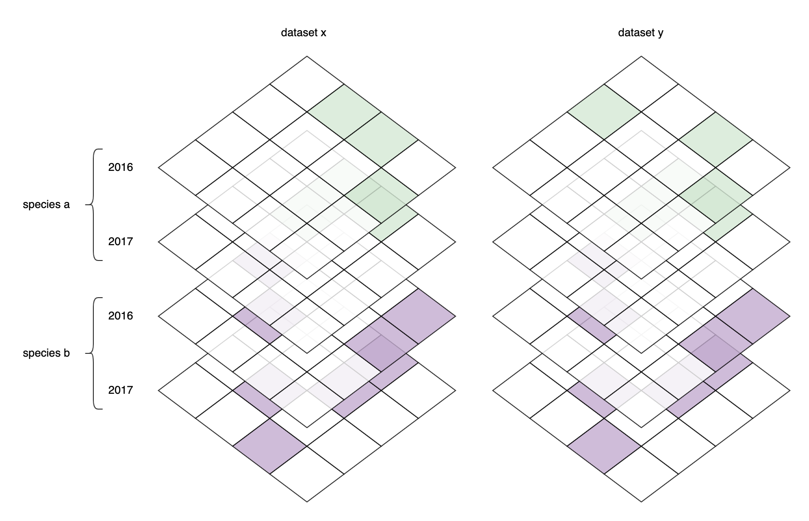

This notebook tries to identify duplicate datasets in the OBIS system. This is done by aggregating datasets by geohash, species, and year, and calculating [cosine similarities](https://en.wikipedia.org/wiki/Cosine_similarity) between datasets. Skip to results [here](#results).



## How to use this notebook

Delete the `vectors` directory to calculate vectors based on the latest data.

## Dependencies

```{r message=FALSE, warning=FALSE}
library(tidyr)
library(glue)
library(Matrix)
library(dplyr)
library(arrow)
library(dplyr)
library(geohashTools)
library(data.table)
library(reactable)
```

## Fetch occurrences from S3

This fetches just the necessary columns from the OBIS export on S3.

```{r message=FALSE, warning=FALSE, eval=FALSE}
space <- S3FileSystem$create(
  anonymous = TRUE,
  scheme = "https",
  endpoint_override = "ams3.digitaloceanspaces.com"
)

occ <- open_dataset(space$path("obis-datasets/exports/obis_20220208.parquet")) %>%
  select(dataset_id, decimalLongitude, decimalLatitude, AphiaID, year = date_year) %>%
  as_tibble()
```

## Aggregate datasets by geohash, species, and year

```{r message=FALSE, warning=FALSE, eval=FALSE}
stats <- occ %>%
  filter(!is.na(year) & decimalLatitude < 90 & decimalLongitude < 180) %>%
  mutate(geohash = gh_encode(decimalLatitude, decimalLongitude, 2)) %>%
  mutate(cell = factor(paste(geohash, AphiaID, year, sep = "_"))) %>%
  group_by(dataset_id, cell) %>%
  summarize(records = n())
```

## Generate vectors and calculate similarity

First generate vectors by dataset and store as `sparseVector`.

```{r message=FALSE, warning=FALSE, eval=FALSE}
n_cells <- length(levels(stats$cell))
dataset_ids <- unique(stats$dataset_id)

vectors <- list()

for (id in dataset_ids) {
  message(id)
  vector <- rep(0, n_cells)
  dataset <- stats %>%
    filter(dataset_id == id)
  for (i in 1:nrow(dataset)) {
    vector[as.numeric(dataset$cell[i])] <- dataset$records[i]
  }
  vectors[[id]] <- as(vector, "sparseVector")
}
```

Calculate similarities using parallelization and write the results to a text file.

```{r message=FALSE, warning=FALSE, eval=FALSE}
write("x y similarity", file = "similarity.txt", append = FALSE)

parallel::mclapply(1:length(dataset_ids), function(i) {
  dataset_x <- dataset_ids[i]
  x <- as.vector(vectors[[dataset_x]])
  for (j in (i + 1):length(dataset_ids)) {
    dataset_y <- dataset_ids[j]
    y <- as.vector(vectors[[dataset_y]])
    similarity <- coop::cosine(x, y)
    line <- paste(dataset_x, dataset_y, format(similarity, scientific = FALSE))
    write(line, file = "similarity.txt", append = TRUE)
  }
}, mc.cores = 6)
```

Plot the similarities to get an idea of the distribution.

```{r message=FALSE, warning=FALSE}
similarity <- fread("similarity.txt", sep = " ", header = TRUE)
plot(similarity$similarity)
```

Create a shortlist of suspect dataset pairs.

```{r message=FALSE, warning=FALSE}
datasets <- robis::dataset() %>%
  tidyr::unnest(statistics) %>%
  select(id, url, title, records = Occurrence)

suspect <- similarity %>%
  filter(similarity > 0.85) %>%
  left_join(datasets, by = c("x" = "id")) %>%
  left_join(datasets, by = c("y" = "id"), suffix = c("_x", "_y")) %>%
  arrange(desc(similarity)) %>%
  as_tibble()

suspect 
```

## Results

```{r message=FALSE, warning=FALSE}
suspect %>%
  mutate(
    title = glue("<a href=\"https://obis.org/dataset/{x}\" target=\"_blank\">{title_x}</a><br/><br/><a href=\"https://obis.org/dataset/{y}\" target=\"_blank\">{title_y}</a>"),
    url = glue("<a href=\"{url_x}\" target=\"_blank\">{url_x}</a><br/><br/><a href=\"{url_y}\" target=\"_blank\">{url_y}</a>"),
    records = glue("{records_x}<br/><br/>{records_y}")) %>%
  select(similarity, title, url, records) %>%
  reactable(columns = list(similarity = colDef(width = 100), title = colDef(html = TRUE), url = colDef(html = TRUE), records = colDef(html = TRUE, width = 100)), pagination = FALSE)
```
